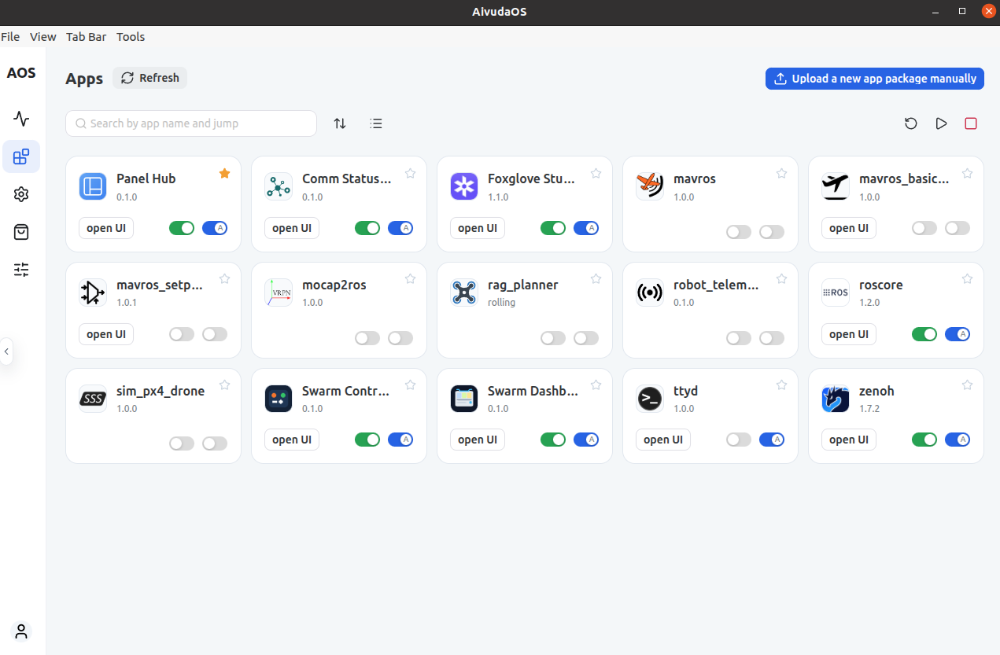

# AivudaOS Electron Shell

This package provides a desktop shell for opening [AivudaOS](https://github.com/shupx/aivudaOS) and AivudaOS-hosted app panels in a dedicated Electron window on Ubuntu and other Linux desktops.

It does not install or start AivudaOS itself. Start your AivudaOS services first, then launch the shell.



## Install

Global install and update with:

```bash
# Use a custom mirror for Electron downloads if needed:
export ELECTRON_MIRROR=https://npmmirror.com/mirrors/electron/ 

npm install -g @aivuda/aivuda-shell@latest 
# or npm install with a custom registry mirror
npm install -g @aivuda/aivuda-shell@latest --registry=https://registry.npmmirror.com
```

One-off run without installing globally:

```bash
npx @aivuda/aivuda-shell
```

The config and browser session data are stored in `~/.config/aivuda-shell/`. Uninstalling the package does not remove those directories.

## Start

Open the default local AivudaOS URL:

```bash
aivuda-shell
```

## Add To App Menu

On Ubuntu or another Linux desktop, install a launcher into your app menu:

```bash
aivuda-shell-install-desktop
```

This creates a user-level `.desktop` entry under `~/.local/share/applications/` and uses the packaged `assets/aivuda_icon.png` icon.

Remove that launcher later with:

```bash
aivuda-shell-remove-desktop
```

## Keyboard Shortcuts

- `Ctrl+T`: open a new tab
- `Ctrl+W`: close the current tab
- `Ctrl+R`: reload the current tab
- `Ctrl+L`: show or hide the tab bar
- `Esc`: hide the tab bar

## Notes

- Default URL: `http://127.0.0.1:80`
- `https://` certificate errors are currently bypassed for local/self-signed deployments
- `Tools -> Show FPS/GPU Overlay` displays the in-page performance overlay
- `Tools -> Screen Record` shows a compact floating bar that can record the current Aivuda window to a local `.webm` file
- `Tools -> Clear Browser Data` clears the persistent browser session data and saved shell state

Developer-oriented setup notes live in `README_dev.md`.
